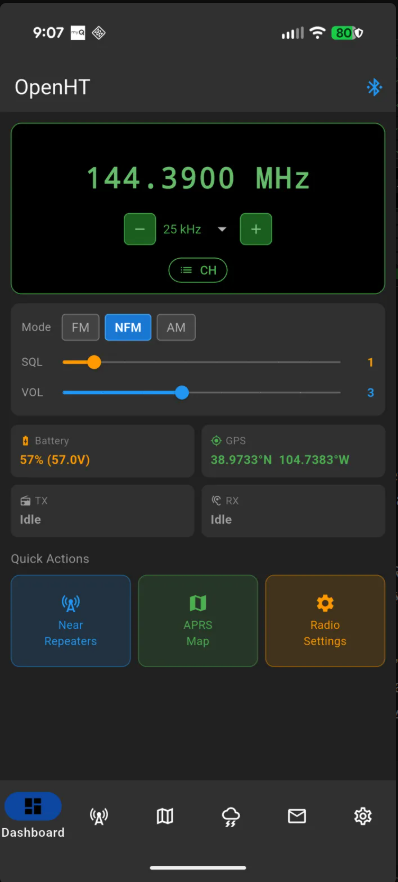
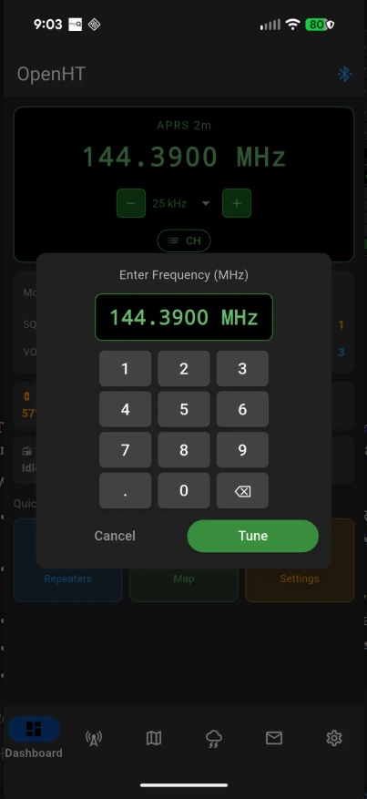
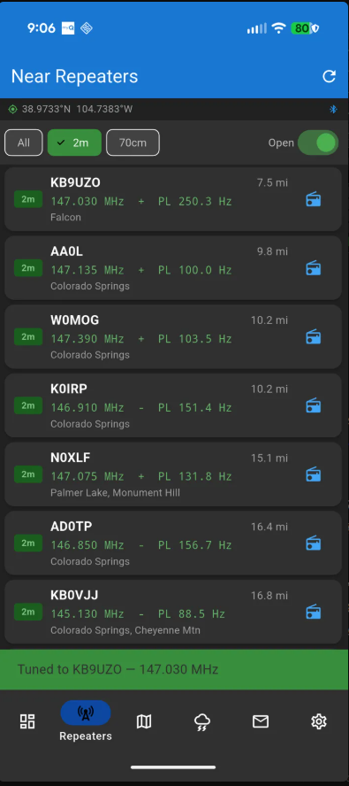
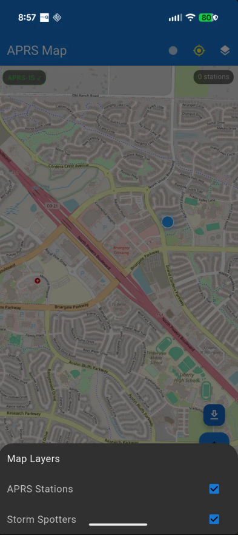
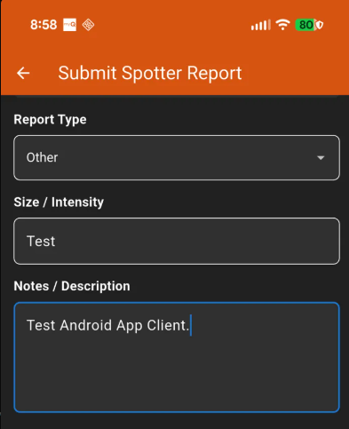

# OpenHT

> Open-source Android controller for VGC / Benshi-protocol radios with Near Repeater, APRS map, and Android Auto support.

[](LICENSE)
[]()
[]()

## 📱 Screenshots

<table>
  <tr>
    <td align="center"><b>Dashboard</b></td>
    <td align="center"><b>Frequency Control</b></td>
    <td align="center"><b>Near Repeater</b></td>
  </tr>
  <tr>
    <td></td>
    <td></td>
    <td></td>
  </tr>
  <tr>
    <td align="center"><b>APRS Map</b></td>
    <td align="center"><b>Spotter Network</b></td>
    <td align="center"></td>
  </tr>
  <tr>
    <td></td>
    <td></td>
    <td></td>
  </tr>
</table>

---

## Supported Radios

| Radio | Status |
|-------|--------|
| Vero VR-N76 | ✅ Primary test device |
| Vero VR-N7600 | ✅ Target hardware |
| Vero VR-N7500 | 🔬 Untested (protocol compatible) |
| BTech UV-Pro | 🔬 Untested (protocol compatible) |
| RadioOddity GA-5WB | 🔬 Untested (protocol compatible) |

---

## Why OpenHT?

The vendor **HT / BS HT** app works, but has significant gaps:

- No "Near Repeater" function — you can't quickly find and tune the closest open repeater
- No offline repeater database — useless without cell service
- No Android Auto integration — dangerous to use while driving
- No open APRS station map with POI markers
- Closed source — no ability to fix bugs or extend features

OpenHT fills those gaps.

---

## Features

### ✅ Implemented
- **Bluetooth connection** to radio via RFCOMM (Bluetooth Classic)
- **Near Repeater** — GPS-based lookup of closest open repeaters from RepeaterBook API
  - Sort by distance, filter by band (2m / 70cm), open/closed status
  - One-tap tune: pushes frequency directly to radio via BT
  - Batch write up to 32 nearest repeaters to radio Group 6
  - **Offline cache** — SQLite local DB for use without cell service
- **APRS Map** — displays decoded APRS beacons as POI markers on OpenStreetMap
- **Dashboard** — frequency display, battery state, TX/RX status, GPS lock
- **Dark theme** — designed for vehicle/night use

### 🚧 In Progress
- Android Auto UI (List template for repeater selection, Nav template for APRS map)
- Full CTCSS/DCS tone programming when tuning
- Audio streaming over BT headset (requires libsbc bindings in flutter_benlink)
- Winlink / BBS integration (port from HtStation)
- BLE connection mode (in addition to RFCOMM)

### 📋 Planned
- Offline repeater DB download by state
- APRS beacon transmission (with callsign + smart beaconing)
- Channel group management / import-export
- APK sideload without Play Store

---

## Architecture

```
lib/
├── main.dart                       # App entry, Provider setup, bottom nav
├── bluetooth/
│   └── radio_service.dart          # Wraps flutter_benlink RadioController
├── repeaterbook/
│   └── repeaterbook_client.dart    # RepeaterBook API client
├── aprs/
│   ├── aprs_packet.dart            # APRS packet parser
│   └── aprs_service.dart           # Packet stream manager
├── services/
│   ├── gps_service.dart            # Continuous GPS tracking
│   └── repeater_cache.dart         # SQLite repeater cache
├── models/
│   └── repeater.dart               # Repeater data model
└── screens/
    ├── dashboard/                  # Main radio status screen
    ├── near_repeater/              # Near Repeater feature (★ core)
    ├── aprs_map/                   # APRS stations on map
    └── settings/                  # BT connect + app config
```

---

## Getting Started

### Prerequisites

- Flutter SDK ≥ 3.10
- Android Studio / Android SDK (API 26+)
- Android device with Bluetooth (BT Classic / RFCOMM support)
- VGC radio paired to your Android device via system Bluetooth settings

### Build

```bash
git clone https://github.com/repins267/OpenHT.git
cd OpenHT
flutter pub get
flutter run
```

### Pairing your radio

1. Power on your VGC radio
2. Android **Settings → Bluetooth → Pair new device**
3. Radio will appear as **VR-N76**, **VR-N7600**, or similar
4. Pair it — you may need to do this **twice** (audio + data channels)
5. Open OpenHT → Settings → **Scan for Radio** → Connect

---

## Near Repeater Flow

```
GPS fix
  → Query RepeaterBook API (lat/lon/radius/band)
  → Cache to local SQLite (works offline after first load)
  → Display sorted list (distance, tone, status)
  → Tap repeater → push VFO frequency to radio via Bluetooth
  → OR: "Write to Radio" → batch program Group 6 with top 32 results
```

---

## Android Auto

OpenHT declares a `CarAppService` targeting the **Navigation** category.  
Android Auto UI will use:

- **List template** — browse Near Repeater results while driving
- **Navigation template** — APRS map with POI markers
- **Message template** — incoming APRS messages

> ⚠️ Android Auto requires testing with the [Desktop Head Unit (DHU)](https://developer.android.com/training/cars/testing/dhu) emulator before deployment.

---

## Credits & Attribution

This project stands on the shoulders of:

| Project | Author | Role |
|---------|--------|------|
| [benlink](https://github.com/khusmann/benlink) | Kyle Husmann **KC3SLD** | Reverse-engineered the Benshi BT protocol |
| [flutter_benlink](https://github.com/SarahRoseLives/flutter_benlink) | SarahRoseLives | Dart/Flutter port of benlink |
| [aprs-parser](https://github.com/k0qed/aprs-parser) | Lee **K0QED** | APRS packet parsing |
| [HtStation](https://github.com/Ylianst/HtStation) | Ylianst | Node.js base station — architecture inspiration |
| [HTCommander](https://github.com/Ylianst/HTCommander) | Ylianst | Windows desktop client — feature reference |
| [RepeaterBook](https://www.repeaterbook.com) | RepeaterBook.com | Repeater database API |

---

## License

Apache-2.0 — see [LICENSE](LICENSE)

> An amateur radio license is required to **transmit** using this software.  
> Get licensed: [arrl.org/getting-licensed](https://www.arrl.org/getting-licensed)

---

## Contributing

PRs welcome. Areas of highest value right now:

1. **CTCSS/DCS tone write** when tuning — needs flutter_benlink API expansion
2. **Android Auto** CarAppService implementation
3. **Audio streaming** — BT headset TX/RX
4. **Testing** with UV-Pro, GA-5WB, VR-N7500 hardware

Please open an issue before starting large features.

---

## 🔐 Why was this built?

Read the [Privacy & Security Audit](./PRIVACY_AUDIT.md) for details on vendor hardware tracking and our mitigation strategies.
