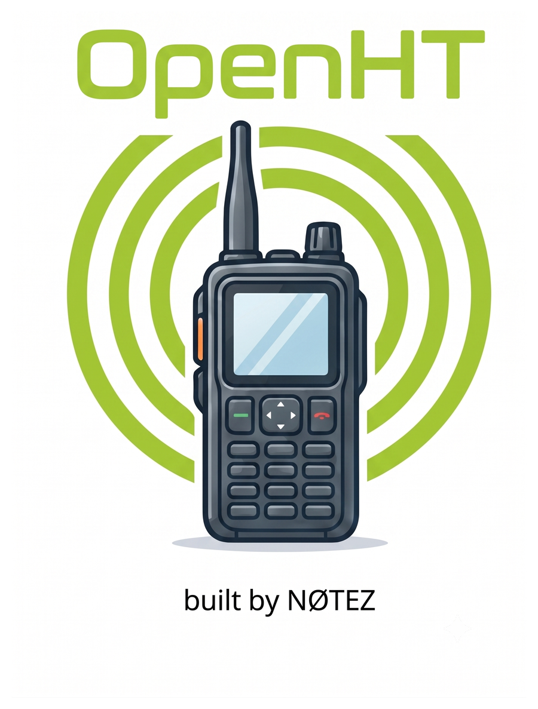
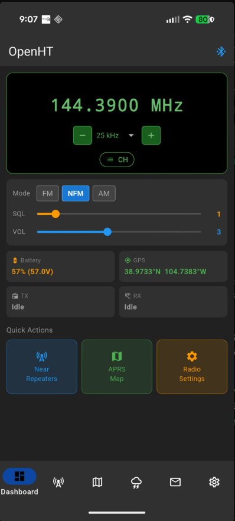
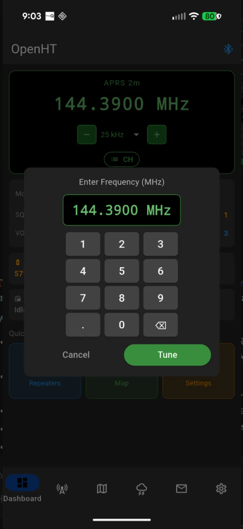
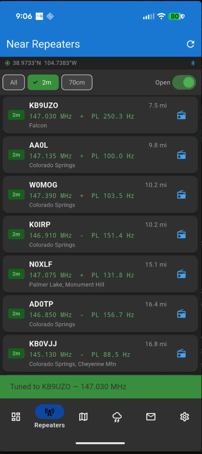
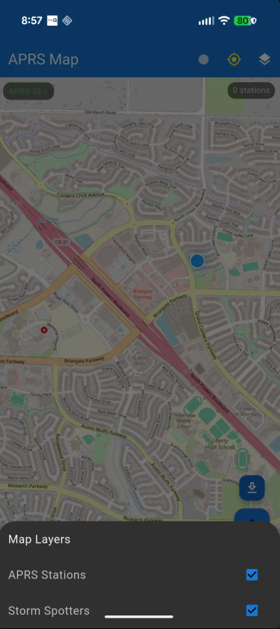
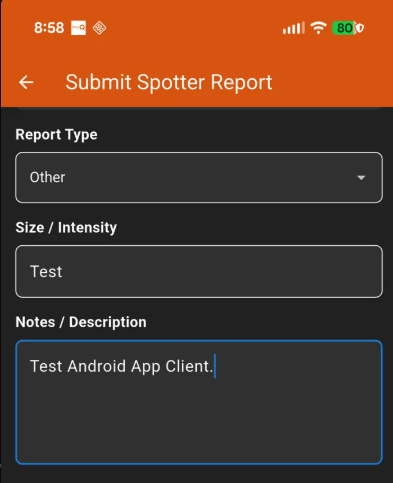

<p align="center">
  
</p>

# OpenHT

> Open-source Android **radio-programming and EmComm companion** for the Vero VR-N76 and
> Benshi-protocol handhelds — channel & group management, frequency-plan/codeplug building,
> full-duplex audio, APRS, and weather-driven emergency tools.

[](LICENSE)
[]()
[]()

**Maintainer:** N0TEZ · [github.com/repins267](https://github.com/repins267)

## 📱 Screenshots

<table>
  <tr>
    <td align="center"><b>Dashboard</b></td>
    <td align="center"><b>Frequency Control</b></td>
    <td align="center"><b>Near Repeater</b></td>
  </tr>
  <tr>
    <td></td>
    <td></td>
    <td></td>
  </tr>
  <tr>
    <td align="center"><b>APRS Map</b></td>
    <td align="center"><b>Spotter Network</b></td>
    <td align="center"><b>DTMF / Signaling</b></td>
  </tr>
  <tr>
    <td></td>
    <td></td>
    <td></td>
  </tr>
</table>

---

## Supported Radios

| Radio | Status |
|-------|--------|
| Vero VR-N76 | ✅ Primary test device |
| Vero VR-N7600 | ✅ Target hardware |
| Vero VR-N7500 | 🔬 Untested (protocol compatible) |
| BTech UV-Pro | 🔬 Untested (protocol compatible) |
| Radioddity GA-5WB | 🔬 Untested (protocol compatible) |

---

## What OpenHT is

A free, open-source companion app that lets you **program and operate your own radio** from your
phone — build codeplugs, manage channels and groups, write frequency plans, and run EmComm/weather
tools the vendor app lacks. It is a radio-programming tool first, not a repeater directory or map.

---

## 🔬 Field Notes (firmware research)

Reverse-engineering notes on the VR-N76 firmware-update system (gRPC check, OSS download, GAIA
flash), the DFU2 image structure, and the signature-enforcement findings:
**[docs/fieldnotes/vr-n76-firmware.md](docs/fieldnotes/vr-n76-firmware.md)**. All RE done on my own
hardware — no vendor binaries redistributed.

---

## Features

### Channel & Group Management
- Read, edit, and write **any of the radio's 6 channel groups** (not just the active one), using the
  region command family (`SET_REGION`, `WRITE_REGION_CH`, `READ/WRITE_REGION_NAME`).
- **Full per-channel editor** — title, RX/TX freq, CTCSS/DCS, TX power, bandwidth, scan, talk-around,
  TX-disable, mute, pre/de-emphasis.
- **Per-group editor** — open any group to see its real channels, edit them, and **rename the group**.
- Themed group writes **clear-then-write** and set the group name.

**Reserved group layout** — you can still write channels or plans to *any* group manually
(channel/group editor, or the Frequency Plans group picker):

| Group | Purpose |
|-------|---------|
| **4** | Emergency-Net Frequency Plans (ARES / RACES / SKYWARN) — written from the **Frequency Plans** menu |
| **5** | NOAA Weather |
| **6** | Near Repeater programming (RepeaterBook — unlocked with an API token) |

### Frequency Plans (codeplug builder)
- Create, edit, and delete **multiple area plans** (bundled templates + your own).
- Write any plan to **any channel group** via a group picker; streaming progress.
- FIPS-linked so weather emergency auto-tune can look up the local plan.

### Audio
- Native **full-duplex SBC audio** over Bluetooth (RX monitor + mic PTT TX), NDK libsbc + Kotlin engine.

### Connection
- Detects a dropped Bluetooth command link and **auto-reconnects** with backoff — no silent wedging.

### APRS
- Live APRS station map (OpenStreetMap), decoded packet markers, distance-sorted list.
- APRS-IS beacon sender + iGate configuration; Spotter Network overlay.
- **Canned (pre-saved) messages** — compose reusable APRS message templates on the phone and send
  them from the message thread with one tap, instead of pad-typing on the radio.

### Signaling (DTMF)
- **DTMF composer** — type or tap a DTMF string (`0-9 A-D * #`) on the phone keyboard, save named
  presets (e.g. *Gate open*), and transmit. OpenHT synthesizes the dual-tone PCM and pushes it out
  the radio's app-audio TX path (keys → tones → unkey) — no more four-way-pad entry on the radio.
- Selectable send speed (Slow / Normal / Fast).

### Weather & Emergency Auto-Tune
- **NOAA/NWS alerts** with SAME/FIPS filtering and push notifications for Severe/Extreme events.
- **NWR (Weather Radio)** nearest-transmitter list + auto-monitor.
- **Emergency auto-tune**: on a Tornado/Severe Thunderstorm Warning, tunes Band A to your local
  SKYWARN plan channel (Priority 1) or the nearest NWR transmitter for the alerted county (Priority 2).

### Settings & Developer Tools
- Channel & Group Manager, Frequency Plans, RepeaterBook, Weather, APRS, Signaling (DTMF), Developer.
- Radio Debug Terminal — live HEX TX/RX log.

### 🚧 Pending
- **RepeaterBook** approved-distributed-app application — the in-app plumbing is complete: secure
  on-device token entry, the `X-RB-App-Token` header, attribution, gating, and the **Near Repeater**
  screen wired to query the RepeaterBook Connect Data API live. Public availability is pending
  RepeaterBook's approval of OpenHT as an approved distributed app; until then it works with a
  developer/beta token.

---

## Data Sources & Approved App Access

OpenHT uses repeater / emergency-net data **only to help you program your own radio**, per-user and
user-triggered. It does **not** provide a public repeater directory, search page, or map service.

OpenHT does **not** cache server-side, store, redistribute, or expose RepeaterBook data to other
users or third parties. Every query uses the individual user's own token, returns data only to that
user's device, and is used solely to program that user's own radio.

### RepeaterBook
Two paths, both keeping value with RepeaterBook:

1. **Emergency-net plan building** (no token) — with the **RepeaterBook Connect** app installed, OpenHT
   builds a **frequency plan of local ARES / RACES / SKYWARN repeaters** (2 m / 70 cm, FM) and writes it
   to **Channel Group 4**, from the **Frequency Plans** menu, using your own RepeaterBook Connect
   subscription. This is the *only* way emergency-net RB data is written, and it only targets Group 4.
2. **Near Repeater** (token required) — queries the **RepeaterBook Connect Data API** live with
   **your own app-bound token** and shows a **distance-sorted list** of nearby 2 m / 70 cm FM
   repeaters (no map), for programming near repeaters into **Group 6**. Results are shown on-device
   for that query only — **nothing is cached or persisted**. Without a token the list stays empty and
   OpenHT prompts you to add one in **Settings → RepeaterBook**.

**Getting a token** (once OpenHT is an approved distributed app):
1. Sign in at [repeaterbook.com](https://www.repeaterbook.com) → **API Apps & Tokens**
   (`repeaterbook.com/user/api_apps.php`).
2. Find **OpenHT** under *Approved Distributed Apps* → **Generate Token**.
3. Copy the `rbuapp_…` token and paste it into **OpenHT → Settings → RepeaterBook**.

OpenHT sends it as `X-RB-App-Token: rbuapp_…`, honors per-app rate limits, and shows
**"Data courtesy of RepeaterBook.com"** wherever RepeaterBook data appears. Tokens are stored securely
on-device (encrypted) and never embedded in the app.

**API usage:** OpenHT calls the RepeaterBook Web API only on explicit user action (Near Repeater
search / "Tune To"), at human-interaction rates, with the user's token in `X-RB-App-Token`. Results
are shown or programmed on-device and are not persisted beyond the session.

> **Approved-app status:** OpenHT is a non-commercial, open-source, distributed client — the same
> category as RepeaterBook's already-approved *HTCommander* port (App #98). No shared secret ships in
> the app; each user authenticates with their own token.

### RadioReference (optional)
For richer emergency-nets data (e.g. the SKYWARN/ARES nets database), OpenHT can integrate the
**RadioReference** SOAP API. RadioReference requires **each user to hold their own active RadioReference
Premium subscription** and authenticate with their own credentials (per-user passthrough). Applies to
the codeplug/programming use case their terms explicitly support.

---

## Getting Started

### Prerequisites
- Flutter SDK ≥ 3.10, Android Studio / Android SDK (API 26+)
- Android device with Bluetooth Classic (RFCOMM)
- A supported radio paired via system Bluetooth

### Build
```bash
git clone https://github.com/repins267/repins267-OpenHT.git
cd repins267-OpenHT
flutter pub get   # pulls flutter_benlink from the repins267 fork
flutter run
```

> OpenHT depends on a fork of `flutter_benlink`
> ([repins267/flutter_benlink](https://github.com/repins267/flutter_benlink), branch `openht`) that adds
> the region channel commands and SBC audio. A local `pubspec_overrides.yaml` can point it at an on-disk
> checkout for development.

### Pairing your radio
1. Power on the radio → Android **Settings → Bluetooth → Pair new device** → pair **VR-N76** (you may
   need to pair twice for audio + data).
2. Open OpenHT → connect the radio.

---

## Frequency Plan Format
Plans are JSON (`assets/freq_plans/<id>.json` for bundled templates; user plans are saved on-device):
```json
{
  "id": "ppraa_el_paso",
  "name": "PPRAA / PPARES — El Paso County",
  "fips": "008041",
  "channels": [
    { "slot": 0, "name": "PPARES",  "rxMhz": 147.345, "txMhz": 146.745, "tone": 107.2, "notes": "" },
    { "slot": 1, "name": "SKYWARN", "rxMhz": 146.970, "txMhz": 146.370, "tone": 100.0, "notes": "" }
  ]
}
```
`fips` matches the 6-digit county SAME code used by NWS. A `SKYWARN` channel drives emergency auto-tune.

---

## Credits & Attribution

| Project | Author | Role |
|---------|--------|------|
| [benlink](https://github.com/khusmann/benlink) | Kyle Husmann **KC3SLD** | Reverse-engineered the Benshi BT protocol |
| [flutter_benlink](https://github.com/SarahRoseLives/flutter_benlink) | SarahRoseLives | Dart/Flutter port (OpenHT uses the [repins267 fork](https://github.com/repins267/flutter_benlink)) |
| [RepeaterBook](https://www.repeaterbook.com) | RepeaterBook.com | Repeater / emergency-net data — *Data courtesy of RepeaterBook.com* |
| [RadioReference](https://www.radioreference.com) | RadioReference.com | Optional emergency-nets database (per-user Premium) |
| [NOAA / NWS](https://www.weather.gov) | NOAA | Weather alerts API + NWR transmitter data |
| [HTCommander](https://github.com/Ylianst/HTCommander) | Ylianst | Feature reference |

---

## License
Apache-2.0 — see [LICENSE](LICENSE).

> An amateur radio license is required to **transmit** using this software.
> Get licensed: [arrl.org/getting-licensed](https://www.arrl.org/getting-licensed)

---

## Contributing
PRs welcome. High-value areas:
1. **Regional frequency plans** — add a JSON plan for your county/ARES group.
2. **Testing** on UV-Pro, GA-5WB, VR-N7500 hardware.
3. **Android Auto**, **APRS beacon TX**, **Winlink/BBS**.

Please open an issue before starting large features.
