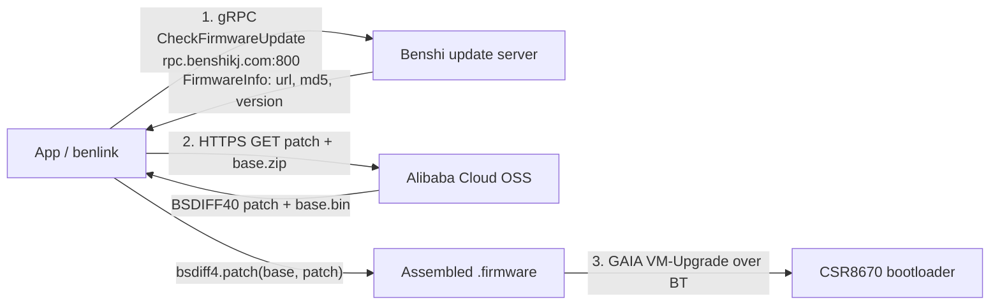

# VR-N76 Firmware — Field Notes

*A field report on the Vero VR-N76 firmware-update system and what it means for custom
firmware. Part walkthrough, part honest ledger of what's proven and what's still open. All
reverse engineering here was done on my own VR-N76; **no vendor firmware binaries are
redistributed** — see [Reproduce it yourself](#7-reproduce-it-yourself) to run the same analysis on
your own hardware.*

> [!NOTE]
> **TL;DR** — The VR-N76 (CSR8670 + STM32F103) takes OTA firmware over Bluetooth via CSR's
> **GAIA VM-Upgrade** protocol. The whole pipeline is mapped: gRPC update **check** → Alibaba Cloud
> OSS **download** (a `bsdiff4` patch on a shared base) → two-phase GAIA **flash**. The DFU2 image is
> cryptographically **signed** (a 132-byte key-dependent block at `0x77c` that is *not* offline
> forgeable) — **but the VM-Upgrade bootloader does not enforce that signature at validation**
> (bench-verified): a payload-modified, stale-signature image is accepted. The remaining unknowns are
> whether a modified image actually *boots* (runtime/secure-boot check), the CSR-compressed payload
> barrier, and the STM32 update path.

> [!WARNING]
> Do not commit/flash a *modified* image until the full custom path is settled end-to-end. The
> enforcement test below is safe *because* it aborts before commit — staged bytes land only in the
> inactive flash bank and are discarded. Keep an SPI recovery path available before attempting a real
> commit.

## Contents

1. [Hardware architecture](#1-hardware-architecture)
2. [The firmware update pipeline](#2-the-firmware-update-pipeline)
3. [DFU2 image anatomy](#3-dfu2-image-anatomy)
4. [The 132-byte signature / keyed-MAC](#4-the-132-byte-signature--keyed-mac)
5. [Signature-enforcement test](#5-signature-enforcement-test)
6. [Custom-firmware toolkit](#6-custom-firmware-toolkit)
7. [Reproduce it yourself](#7-reproduce-it-yourself)
8. [Proven vs. open — honest ledger](#8-proven-vs-open--honest-ledger)
9. [Tooling & file map](#9-tooling--file-map)
10. [Credits & collaboration](#10-credits--collaboration)

---

## 1. Hardware architecture

| Component | Role | Notes |
|---|---|---|
| **CSR8670** (XAP2 core) | Bluetooth + audio + OTA bootloader | Runs the GAIA / VM-Upgrade firmware-update state machine — this is what receives and validates the OTA image. |
| **STM32F103** | Radio / control MCU | Drives the RF chain, front panel, channels. A separate processor from the BT SoC. |
| Transport | DFU2 over BT | Firmware is delivered on a **separate RFCOMM channel** from the main command channel (VM UUID `00001107-D102-11E1-9B23-00025B00A5A5`). |
| Product ID | `259` | The VR-N76's numeric product id (read from `GET_DEV_INFO`). Keys the update server. |

**Corrected data path** (from STM32 RE, 2026-05-29):

```text
Phone ⇄ (USB-C / BT) ⇄  CSR8670  (vm.app: USB device, GAIA, BT, audio, KISS/APRS/AT)
                          │  UART (FF 01 GAIA frames)
                          ▼
                    STM32F103 (dis_firmware): RF control (RDA1846S via I²C), keypad, display, GPS
```

The STM32 is a **UART-attached command handler** behind the CSR8670's USB↔UART bridge — it is
*not* the USB endpoint. It parses the `FF 01` GAIA frames the CSR relays and drives the RF
hardware. Its firmware ships as a file (`dis_firmware`) **inside** the OTA image (see §3).

---

## 2. The firmware update pipeline

Three layers, implemented in [`benlink`](https://github.com/khusmann/benlink) PR #25: `firmware.py`
(check + download) and `firmware_updater.py` (flash).



### 2.1 Layer 1 — Update check (gRPC)

Host: `rpc.benshikj.com:800` — **TLS on port 800**, not 443. There are two methods; the legacy one is
retired server-side.

> [!IMPORTANT]
> **The #1 gotcha:** the legacy `/benshikj.APP/CheckUpdate` `{did, firmwareVersion, model}` returns a
> **zero-byte response** (`haveUpdate=false`) for *every* input against the current backend — empty
> did, dummy did, any model/version. That looks like a "DID mystery," but it isn't: the live app
> (v2.9.2.1) switched to **`/benshikj.DeviceManagement/CheckFirmwareUpdate`**, which keys on the
> numeric **productId** and has **no `did` field at all**.

**Current request — `CheckFirmwareUpdateRequest` (proto3; omits zero/false fields):**

| Field # | Name | Type | Notes |
|---|---|---|---|
| 1 | productId | int32 | From `GET_DEV_INFO` (`DevInfo.product_id`, 16-bit). VR-N76 = **259**. Required. |
| 2 | firmwareVersion | int32 | Current fw as int; **0 = always offer the latest**. |
| 3 | beta | bool | Request the beta channel. |
| 4 | userId | int64 | Account id; 0 omits it. |
| 5 | inviteCode | int32 | Beta invitation code (e.g. 510937). |

**Response — `CheckFirmwareUpdateResult { firmware:FirmwareInfo=1, base:FirmwareInfo=2 }`**, each
`FirmwareInfo { version:int=1, url=2, md5=3, releaseNotes=4, releaseDate=5 }` (`version` is a varint
int, e.g. `147` — not the user string `V0.9.3-7`).

**Live proof** (`productId=259`, `firmwareVersion=0`, confirmed against the live server):

```text
version   = 147
patch_url = https://pubdatas.oss-cn-shenzhen.aliyuncs.com/firmware/v147/patch_base_to_vr_n76.bin
base_url  = https://pubdatas.oss-cn-shenzhen.aliyuncs.com/upgrade_base_v1.bin.zip
fw md5    = 0c0d095da50bebe664822adcb244834a   (patch)
base md5  = 74b6d097d8d2d9d2d9fac88133198a08   (base zip)
```

<details>
<summary>On the legacy <code>did</code> and the 64-byte GET_DEV_ID token</summary>

The legacy `did` is the **human-readable S/N** printed in the radio's Status menu — no OTA command
reads it, so the reference expects you to type it in. Separately, the radio exposes a `GET_DEV_ID`
command that returns a **64-byte high-entropy opaque token** — an encrypted/registration identity
(tied to the unimplemented `DEV_REGISTRATION`, extended command 1825), **not** the plaintext serial.
It is not accepted as `did` in hex or base64. None of this matters for the current method: no did, no
token, no S/N — just `productId`. *(GET_DEV_ID token behavior cross-confirmed with the HTCommander
project.)*
</details>

### 2.2 Layer 2 — Download & assemble (OSS + bsdiff4)

The server hands back OSS URLs; the final image is assembled locally.

- **Patch:** `.../firmware/v{N}/patch_base_to_vr_n76.bin` (`BSDIFF40` magic; ~87 KB)
- **Base:** `.../upgrade_base_v{N}.bin.zip` (zip containing `upgrade_base.bin`; ~659 KB)
- **Assemble:** `firmware = bsdiff4.patch(base_bin, patch_bin)`
- The internal version `N` (147) differs from the user string (V0.9.3-7). The **base image (v1) is
  shared across many releases** — same base + a small per-release patch.

The public OSS URLs require no serial, no token, no gRPC — so "Download Latest" works even when the
check is skipped. The only thing the *server* adds is telling you which `v{N}` is newest.

### 2.3 Layer 3 — Flash (GAIA VM-Upgrade over BT)

Separate RFCOMM channel (VM UUID `00001107-D102-11E1-9B23-00025B00A5A5`). Two phases split by a
radio reboot.

```text
Phase 1 — transfer:
  VM_CONNECT
  -> UPDATE_SYNC_REQ  (md5_tail = last 4 bytes of image md5)
  <- UPDATE_SYNC_CFM  (update_state)
  -> UPDATE_START_REQ
  <- UPDATE_START_CFM (OK -> continue; GOTO_NEXT_STATE -> already mid-update)
  -> UPDATE_START_DATA_REQ
  <- UPDATE_DATA_BYTES_REQ (device pulls: n_bytes_requested @ offset += n_bytes_skip)
  -> UPDATE_DATA (chunks; is_final_fragment=True on last)
  -> UPDATE_IS_VALIDATION_DONE_REQ  (poll)
  <- UPDATE_TRANSFER_COMPLETE_IND
  -> UPDATE_TRANSFER_COMPLETE_RES(is_complete=True)   <- COMMIT POINT (radio reboots)

Phase 2 — confirm (after reconnect):
  VM_CONNECT -> UPDATE_SYNC_REQ -> UPDATE_START_REQ (GOTO_NEXT_STATE)
  -> UPDATE_IN_PROGRESS_RES
  <- UPDATE_COMPLETE_IND
  VM_DISCONNECT
```

> [!NOTE]
> The device is **pull-driven**: after `UPDATE_START_DATA_REQ` it repeatedly asks for N bytes at a
> skip offset and you answer with `UPDATE_DATA`. Validation happens **before**
> `UPDATE_TRANSFER_COMPLETE_RES` — that seam is what the enforcement test uses (drive to validation,
> read the verdict, then abort without committing).

---

## 3. DFU2 image anatomy

The image is a Benshi `APPUHDR2` wrapper around a **CSR DFU container** (`CSR-dfu`) that carries
firmware for **both** processors, plus assets:

| Area | Magic | Contents |
|---|---|---|
| Wrapper header | `APPUHDR2` | Benshi outer header; a **132-byte key-dependent signature at `0x77c`** (see §4) |
| CSR stack | `CSRbcfw1` | CSR8670 firmware text+const (**XAP** core) |
| FileSystem | `fsr_dfu1` | **`vm.app`** (CSR VM app — GAIA/BT/audio/USB), **`dis_firmware`** (the STM32F103 image), `*.pcm` audio, `config` — preceded by its **own 128-byte signature + uint32 checksum** |
| Footer | `APPUPFTR` | CSR upgrade footer (CSR checksum) |

**Two firmware images, two signature blocks.** The CSR8670's own stack (`CSRbcfw1`) and the STM32's
`dis_firmware` (a file inside the signed FileSystem) both ride in one OTA. The **outer 132-byte
signature** (`0x77c`) and the **FileSystem's 128-byte signature** are distinct — which one covers a
given edit determines which gate you're testing (see §5, §8).

`custom_firmware.py`'s "cleartext bootstrap" editing window (`0xA50C`..`+0x26000`) sits in the CSR
**stack** region; the bulk above it is a **CSR-compressed blob** (unsafe to edit without handling the
compression). The `extract_dfu_fs.py` tool walks the `fsr_dfu1` FileSystem to pull `vm.app` /
`dis_firmware` / configs.

---

## 4. The 132-byte signature / keyed-MAC

Differential analysis across 10 firmware images:

| Observation | Implication |
|---|---|
| All 132 bytes vary across every image (0 constant offsets) | Not a fixed header / static tag |
| ~uniform-random byte distribution (107/256 distinct, max repeat 3) | Looks like cipher/hash output |
| Fully changes v124→v125 even though payloads differ by ~15 bytes | Full avalanche → rules out a per-partition hash table |
| No MD5 / SHA1 / SHA256 / CRC32 of any image region reproduces it | **Not offline-recomputable** |

> [!IMPORTANT]
> The block is a **key-dependent signature / keyed-MAC** — it cannot be forged without the OEM
> signing key. So the custom-firmware question reduces to one on-radio experiment: does the
> bootloader *enforce* this block?

---

## 5. Signature-enforcement test

**Idea:** flip ONE byte in the cleartext bootstrap, leave the signature block + footer UNCHANGED,
push the image via VM-Upgrade, drive to device-side validation, read the verdict, then **abort before
commit**. Safe: staged bytes live in the inactive bank and are discarded; the running firmware is
untouched; no reboot.

**Step by step:**

```bash
# 1. Build the enforcement-test image (one cleartext byte flipped; sig/footer intact)
python custom_firmware.py make-test 259.firmware test.firmware
#   flipped byte @0xb50c: 0x37 -> 0xc8
#   signature block @0x77c: UNCHANGED (cannot be regenerated)
#   download-phase MD5 of test image (advertise as FirmwareInfo.md5): <md5>

# 2. Control run FIRST with a genuine image — proves the harness validates a real image
python firmware_enforcement_test.py --mac AA:BB:CC:DD:EE:FF --image 259.firmware --control
#   => expect PASS (control): harness OK

# 3. Real run with the modified image — the actual verdict
python firmware_enforcement_test.py --mac AA:BB:CC:DD:EE:FF --image test.firmware
```

**Reading the verdict — CSR `UpgradeHostErrorCode` in `UPDATE_ERROR`:**

| Code(s) | Meaning | Verdict |
|---|---|---|
| `PASS` (TRANSFER_COMPLETE_IND, no error) | Radio accepted a payload-modified image with a stale signature | **Signature NOT enforced → custom firmware OPEN** |
| `0x38`–`0x3E` OEM_VALIDATION_FAILED_* | `0x3C` PARTITION_DATA / `0x3D` FOOTER cover the payload+footer we changed | Signature / OEM auth **ENFORCED** |
| `0x30`–`0x35` BAD_LENGTH_* | Structural / framing / checksum only | CSR footer CRC may be recomputable |
| `0x21` BATTERY_LOW / `0x22` INVALID_SYNC / `0x81` SYNC_DIFFERENT | Environmental / resume | Not a verdict — charge & retry |

> [!TIP]
> **Bench verdict: PASS — the signature is NOT enforced.** The radio accepted the payload-modified /
> stale-signature image at validation, so there is no meaningful payload authentication at the
> VM-Upgrade layer. Custom firmware is open *in principle*. What remains: proving a modified image
> actually **boots and runs** (§8).
>
> **Scope caveat:** the flipped byte lands in the **CSR stack** region (outer `0x77c` signature). The
> FileSystem's 128-byte signature — which covers `vm.app` and the STM32 `dis_firmware` — is a
> *separate* gate; to prove *that* one, re-run this with a byte flipped inside a FileSystem file.

---

## 6. Custom-firmware toolkit

`custom_firmware.py` is read-only on sources and writes only paths you pass. Everything *valid and
recomputable* is implemented; the non-forgeable signature is copied through unchanged.

| Command | What it does |
|---|---|
| `report <image>` | Dump DFU2 structure + offsets + download-MD5 |
| `apply --base B <patch> <out>` | Apply a `BSDIFF40` patch to a base (validated path) |
| `build-patch --base B <image> <out>` | Create a valid `base→modified` `BSDIFF40` patch (round-trip verified) |
| `make-test <image> <out>` | Flip one cleartext byte for the enforcement test; report new download-MD5 |
| `forge-signature` | Intentionally impossible — explains why the block can't be forged |

```text
$ python custom_firmware.py report 259.firmware
image      : 259.firmware
size       : 1038256  md5(download-check)=<...>
DFU2 header: 0x0..0xa50c
sig block  : 0x77c..0x800  (132 B, KEY-DEPENDENT, not forgeable)
payload    : 0xa50c..0x...
footer     : 0x...  (APPUPFTR, N B)
cleartext-editable bootstrap window: 0xa50c..0x2650c
```

---

## 7. Reproduce it yourself

Everything here can be reproduced on **your own** legally-fetched firmware. I do **not** distribute
VGC/Benshi firmware binaries or a decompilation — that's their copyrighted code. This section is the
map; the territory is your own radio.

**1. Fetch the firmware (public OSS, no auth):**

```bash
curl -O https://pubdatas.oss-cn-shenzhen.aliyuncs.com/upgrade_base_v1.bin.zip
curl -O https://pubdatas.oss-cn-shenzhen.aliyuncs.com/firmware/v147/patch_base_to_vr_n76.bin
```

Or ask the server for the current version (see §2.1): `CheckFirmwareUpdate(productId=259)` returns the
live `v{N}` URLs.

**2. Assemble:**

```bash
unzip upgrade_base_v1.bin.zip           # -> upgrade_base.bin
python custom_firmware.py apply --base upgrade_base.bin \
       patch_base_to_vr_n76.bin 259.firmware
# (or any BSDIFF40 tool: bspatch upgrade_base.bin 259.firmware patch_base_to_vr_n76.bin)
```

**3. Inspect the structure:**

```bash
python custom_firmware.py report 259.firmware
```

**4. Disassemble your own image:** load the payload (from `0xA50C`) in Ghidra. Note the CSR8670 core
is **XAP2**, and the DFU2 container/footer are CSR (`APPUHDR2` / `APPUPFTR`). The cleartext bootstrap
is the readable region; the bulk sits in a **CSR-compressed blob** (see §8, gap #4). *(Whether the
payload also carries STM32/ARM code is an open question — §8, gap #5.)*

**5. Determine enforcement on your unit** with §5 — it's safe (aborts before commit).

---

## 8. Proven vs. open — honest ledger

| Item | Status |
|---|---|
| gRPC update check (current `CheckFirmwareUpdate`, productId-keyed) | ✅ Proven, live |
| OSS download + `bsdiff4` assemble → valid image | ✅ Proven |
| GAIA VM-Upgrade two-phase flash protocol | ✅ Mapped & implemented |
| DFU2 image structure + signature block located | ✅ Proven |
| 132-byte block = key-dependent signature (not forgeable offline) | ✅ Proven |
| Signature **enforcement** at VM-Upgrade validation | ✅ Bench-tested → **NOT enforced (PASS)** |
| **Runtime / secure-boot check** — does a modified image actually *boot*? | 🔬 **Open — biggest unknown** |
| **CSR-compressed payload** — decompress / re-compress the bulk of the code | 🔬 Open — only the small cleartext bootstrap is editable today |
| **STM32F103 update path** — where the RF logic lives | ✅ **Resolved** — `dis_firmware` is bundled as a file in the OTA's CSR DFU FileSystem; STM32 = UART command handler driving the RDA1846S, no USB |
| **STM32 own integrity check** | ✅ **None** — the STM32 does zero signature/crypto verification; signing is entirely CSR-side |
| **FileSystem 128-byte signature** (covers `vm.app` + `dis_firmware`) | 🔬 Open — a *distinct* gate from the tested outer sig; to modify the STM32/VM-app, re-run the enforcement test with a byte flipped inside a FileSystem file |
| **SPI recovery** validated (brick safety net) | 🔬 Open — required before any real commit |
| APPUPFTR footer CRC coverage (for arbitrary edits) | 🔬 Open |
| Full custom-image commit end-to-end | 🔬 Open |
| Downgrade to older/unsigned loader | 🔬 Open |
| Signing key + algorithm | 🔒 Unknowable without the key (by design) |

**The realistic picture:** firmware *fetching/assembly* is complete and usable today. The STM32
question is resolved — its firmware rides in the OTA and it does no signing of its own, so custom
*radio* behavior is on the table in principle. For actual custom firmware, the outer signature gate
is open, but **runtime secure-boot, the CSR-compression barrier, and the FileSystem-level signature**
(which specifically covers the STM32/`vm.app` files) stand between here and a running modified image
— and SPI recovery must be confirmed before risking a commit.

---

## 9. Tooling & file map

- `benlink/src/benlink/firmware.py` — Layers 1 & 2 (check + download + assemble), gRPC wire encode/decode
- `benlink/src/benlink/firmware_updater.py` — Layer 3 (`FirmwareUpdater`: transfer / confirm)
- `benlink/src/benlink/protocol/command/dev_info.py` — `DevInfo` / `GET_DEV_INFO` (productId source)
- `benlink/src/benlink/protocol/command/vm.py` — VM-Upgrade message types
- `custom_firmware.py` — DFU2 toolkit (report / apply / build-patch / make-test)
- `firmware_enforcement_test.py` — safe on-radio enforcement test
- CSR8670 Ghidra project + scripts (kept off-repo)

---

## 10. Credits & collaboration

- **[benlink](https://github.com/khusmann/benlink)** — Kyle Husmann (KC3SLD), reverse-engineered the
  Benshi BT protocol. Firmware-update support (PR #25) upstreamed by Cyrus (N0TEZ).
- **[HTCommander](https://github.com/Ylianst/HTCommander)** — Ylian Saint-Hilaire. Independent C#
  implementation + a firmware blog series; the `GET_DEV_ID` opaque-token behavior was
  cross-confirmed between projects.
- All RE performed on the **VR-N76** only. **No vendor firmware binaries are redistributed** — see §7.

*Maintainer: Cyrus (N0TEZ) · Last updated 2026-07-13.*
